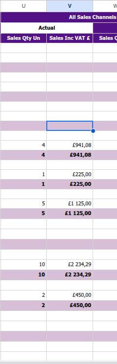

When reading the Liberty document here are some rules:

1.column "reseller": Customer is Liberty and they named their document to name like "Continuity Supplier Size Report".
2.product_ean: does not exist in the document - we will match this in supabase. 
3. month: is usally named in the filename. Continuity Supplier Size Report 01_06_2025.xlsx - in this file it is for May 2025. Because Liberty runs their report weekly and the report is for the previous week from filename date. The output here should be 5.
4. year: usally in the filename.
5. Quantity: Reads from doc in column "U" - All sales channels - actual. See this picture:  Here you can see that 2 rows has the same qt. you are only to read from one of those rows. I sgueest you read from the rows that is in the bottom of those pairs. Then you can read the "functional_name" from the same row but from column "F".
6. Sales_lc: read from "V" from the same row as quantity.
7. Currency are always GBP
8. functional_name: reads from column "F", the same row as "quantity" and "sales_lc" Bottom of the pairs.

Hers is the SQL schema for to insert into: 
create table public.sellout_entries2 (
  id uuid not null default gen_random_uuid (),
  product_ean text null,
  month integer null,
  year integer null,
  quantity integer null,
  sales_lc text null,
  sales_eur numeric null,
  currency text null,
  created_at timestamp without time zone null default now(),
  reseller text null,
  functional_name text null,
  upload_id uuid null,
  constraint sellout_entries2_pkey primary key (id),
  constraint sellout_entries2_product_ean_fkey foreign KEY (product_ean) references products (ean),
  constraint sellout_entries2_upload_id_fkey foreign KEY (upload_id) references uploads (id) on delete set null,
  constraint sellout_entries_month_check check (
    (
      (month >= 1)
      and (month <= 12)
    )
  ),
  constraint sellout_entries_year_check check ((year >= 2000))
) TABLESPACE pg_default;

create index IF not exists idx_sellout_entries2_product_ean on public.sellout_entries2 using btree (product_ean) TABLESPACE pg_default;

create index IF not exists idx_sellout_entries2_reseller on public.sellout_entries2 using btree (reseller) TABLESPACE pg_default;